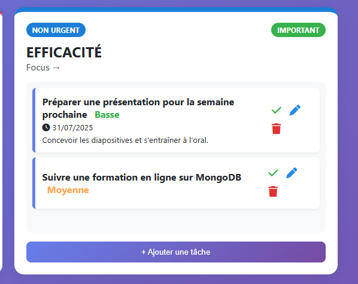
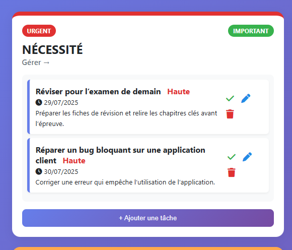
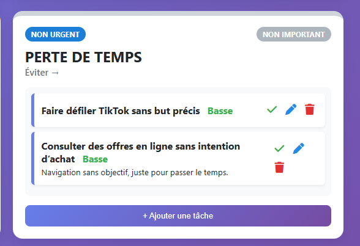
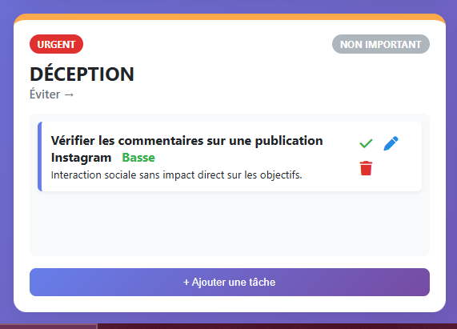

# GèreTout

GèreTout est une application web de gestion des tâches inspirée de la matrice d'Eisenhower. Elle aide les utilisateurs à organiser leurs priorités et à mieux gérer leur temps.

## 🚀 Fonctionnalités

✅ Ajouter des tâches avec un titre, une description et une priorité  
✅ Classer les tâches dans les 4 quadrants de la matrice Eisenhower :  
- Important et Urgent
    **📸 Aperçu
         
- Important mais Pas Urgent
    **📸 Aperçu
         
- Pas Important mais Urgent
    **📸 Aperçu
         
- Pas Important et Pas Urgent
    **📸 Aperçu
           
✅ Modifier et supprimer des tâches
     **📸 Aperçu
         
✅ Interface claire et responsive
     **📸 Aperçu
         

## 🛠️ Technologies utilisées

- HTML5
- CSS3 / Bootstrap
- JavaScript
- Node.js (Backend)
- MongoDB (Base de données)

## 💻 Installation

- Clonez le dépôt :
   ``bash
   git clone https://github.com/ayabohtey12/GereTout.git

   
## ✨ Auteur
👤 Aya Bohthey

GitHub: @ayabohtey12

Email: ayabohtey12@gmail.com
